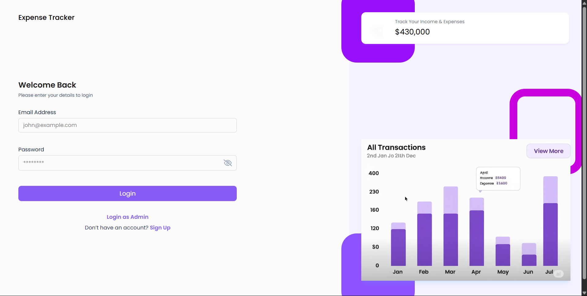
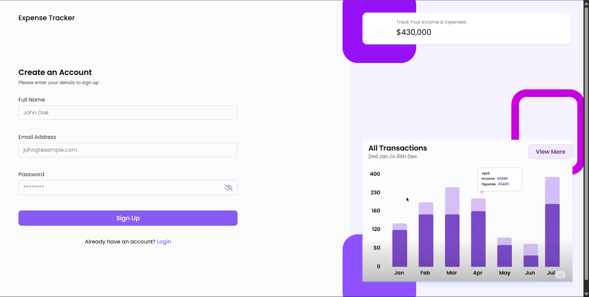
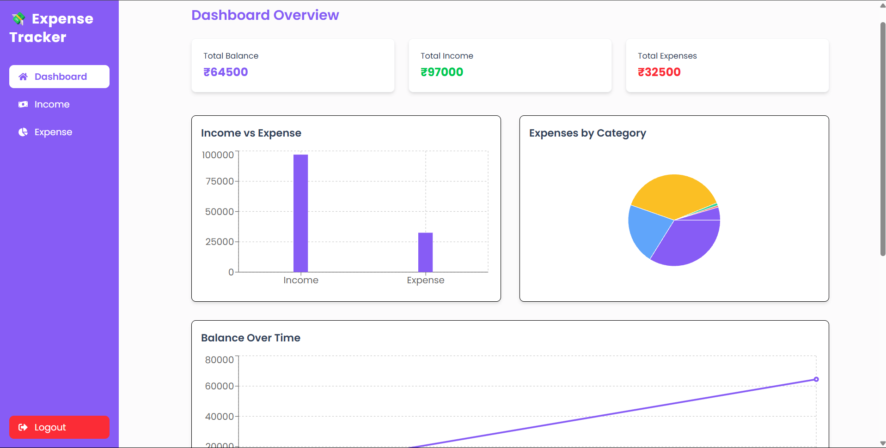
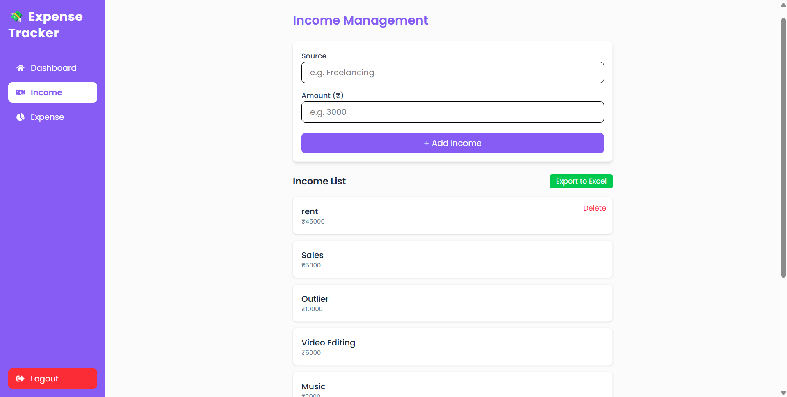
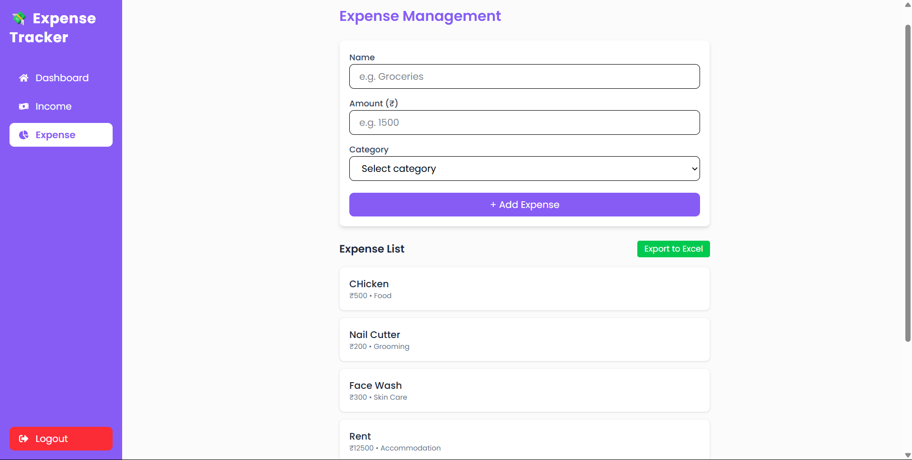
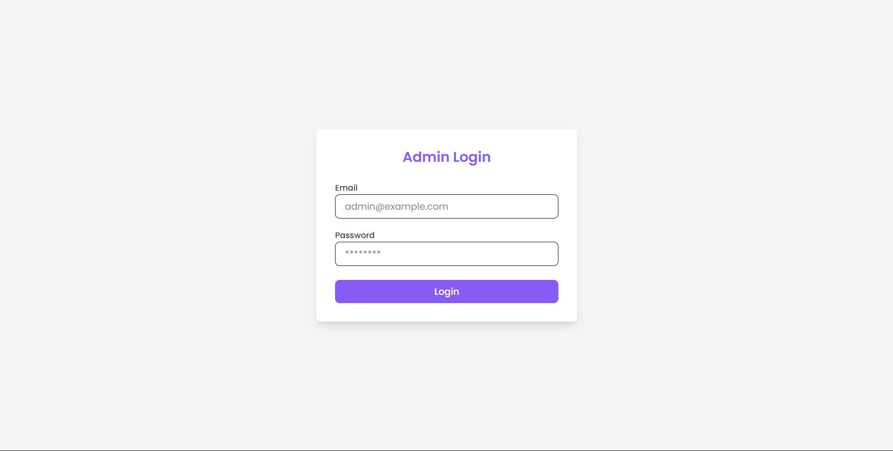
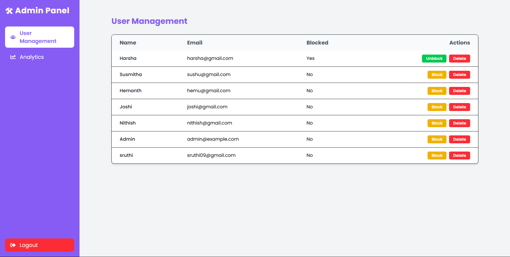
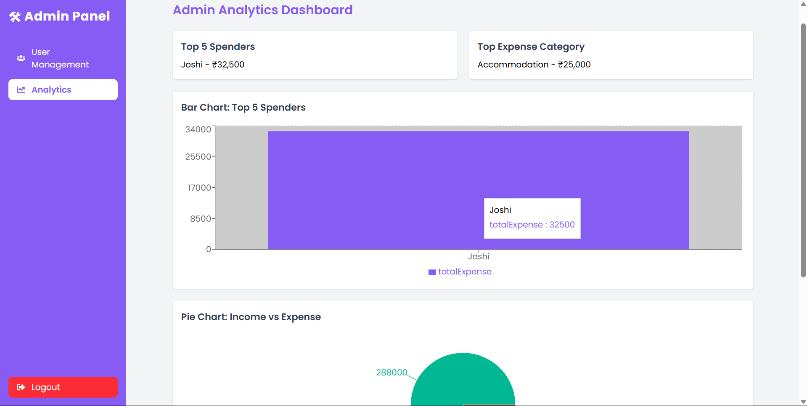
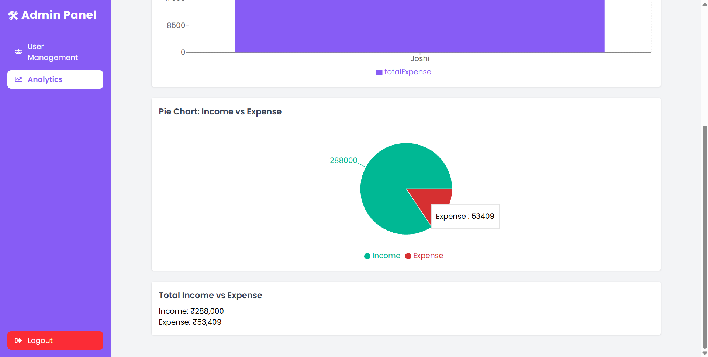

# 💰 Expense Tracker Web Application

A full-stack MERN (MongoDB, Express.js, React, Node.js) web application that helps users track their income and expenses, with a clean and responsive UI. It also includes a secure admin dashboard to manage users and view overall analytics.

---

## ✅ Features

### 👤 User Features
1. **User Authentication** – Secure registration and login using JWT tokens.
2. **Dashboard Overview** – Visual summary of total balance, income, and expenses.
3. **Income Management** – Add, view, delete, and export income records.
4. **Expense Management** – Add, view, delete, and export expense records with category tracking.
5. **Interactive Charts** – Bar, Pie, and Line charts for financial visualization.
6. **Recent Transactions** – Shows the latest income and expense records.
7. **Reports** – Download income and expense reports in Excel format.
8. **Mobile Responsive UI** – Fully optimized for all device sizes.
9. **Sidebar Navigation** – Easy navigation between Dashboard, Income, Expenses, and Logout.
10. **Hover-to-Delete** – Delete buttons appear on hover for income and expense cards.

### 🛠️ Admin Features
11. **Admin Login** – Separate login screen and secure access for admin.
12. **Admin Dashboard** – Overview of registered users and financial statistics.
13. **User Management** – Admin can view and manage all user accounts.
14. **Admin Analytics** – Graphical representation of global data using charts.

---

## 📁 Folder Structure

### 🔧 Backend (`/backend`)

```
backend/
├── config/                 # Configuration files (e.g., database)
│   └── db.js
├── controllers/           # Route handler logic
│   ├── adminController.js
│   ├── authController.js
│   └── expenseController.js
├── middlewares/           # Auth and error handling middleware
│   └── authMiddleware.js
├── models/                # Mongoose models
│   ├── Expense.js
│   ├── Income.js
│   └── User.js
├── routes/                # API routes
│   ├── adminRoutes.js
│   ├── authRoutes.js
│   └── expenseRoutes.js
├── utils/                 # Utilities like Excel export
│   └── exportToExcel.js
├── .env                   # Environment variables
├── app.js                 # App config and middleware
└── server.js              # Entry point to start the backend server
```

### 🌐 Frontend (`/frontend`)

```
frontend/
├── public/                # Static files and favicons
├── src/
│   ├── assets/            # Icons, logos, and images
│   ├── components/        # Reusable components (charts, cards, layout)
│   │   ├── Chart.js
│   │   ├── Sidebar.js
│   │   ├── Navbar.js
│   │   └── IncomeCard.js
│   ├── pages/             # Main pages
│   │   ├── Login.js
│   │   ├── Register.js
│   │   ├── Dashboard.js
│   │   ├── Income.js
│   │   ├── Expense.js
│   │   ├── AdminDashboard.js
│   │   └── UserManagement.js
│   ├── services/          # API interaction logic
│   │   ├── authService.js
│   │   └── expenseService.js
│   ├── App.js             # App routes and layout
│   ├── index.js           # React root render
│   └── styles.css         # Tailwind or custom CSS
```

---

## 🖼️ Screenshots

### 🔐 User Screens
- 
- 
- 
- 
- 

### ⚙️ Admin Screens
- 
- 
- 
- 

> 📸 _To update screenshots, place images inside the `screenshots/` folder in your project root._

---

## 📦 Installation & Setup

### ⚙️ Prerequisites
- Node.js and npm
- MongoDB (local or Atlas)
- React (Create React App)

### 🔄 Clone the Project

```bash
git clone https://github.com/harshaKARNATI20/Expense-Tracker.git
cd expense-tracker
```

---

### 📌 Backend Setup

```bash
cd backend
npm install
```

Create a `.env` file in `backend/` and add:

```
PORT=5000
MONGO_URI=your_mongodb_connection_uri
JWT_SECRET=your_jwt_secret
```

Run the server:
```bash
npm start
```

---

### 🌐 Frontend Setup

```bash
cd frontend
npm install
npm start
```

---

## ⚙️ Tech Stack

- **Frontend**: React, Chart.js, Tailwind CSS / Bootstrap
- **Backend**: Node.js, Express.js
- **Database**: MongoDB with Mongoose
- **Auth**: JSON Web Tokens (JWT)
- **Export**: ExcelJS or SheetJS
- **Charts**: Chart.js (Bar, Pie, Line)

---

## 🧾 License

This project is licensed under the MIT License. Feel free to use and modify it.

---

## ✍️ Author

**Your Name** – harshavardhanhasty@gmail.com

Project Link: https://github.com/harshaKARNATI20/Expense-Tracker/
